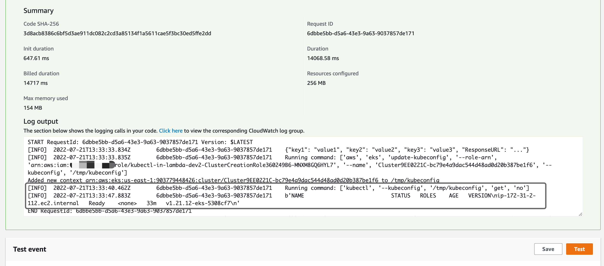

# kubectl-in-lambda

AWS CDK sample to deploy Amazon EKS cluster and a separate lambda function to execute `kubectl` command within Lambda against the cluster. 

## HOWTO

This stack creates an Amazon ESK cluster 1.21 and a Lambda function with container runtime. After the deployment, go to the lambda console and manually execute the function. It will simply run `kubectl get no` and list the nodes in the lambda log streams.



## deploy

```sh
$ npx cdk diff
$ cdk deploy
```

## destroy 

```sh
$ npx cdk destroy
```

## Lambda environment variables

- `ADMIN_ROLE_ARN` - The IAM role ARN for the cluster that maps to `system:masters`. Lambda function will assume this role to run `kubectl` command.

- `CLUSTER_NAME` - The Amazon EKS cluster name. We need the cluster name to run `aws eks update-kubeconfig` in lambda.


## FAQ

1. Can I run this lambda function with a cluster created by `eksctl`?

Yes it is technically possible. You need to pass `ADMIN_ROLE_ARN` and `CLUSTER_NAME` to the lambda environment variables and update `fn.addToRolePolicy()` to allow lambda function `eks:DescribeCluster` your cluster.

2. Can I run `kubectl apply -f manifest`?

Yes. Check [this sample](https://github.com/aws/aws-cdk/blob/main/packages/%40aws-cdk/aws-eks/lib/kubectl-handler/apply/__init__.py).

3. Can I customize the `kubectl` version or add additional executables in my Lambda function?

Yes. Customize this lambda function container runtime in the `Dockerfile` under `docker.d`.